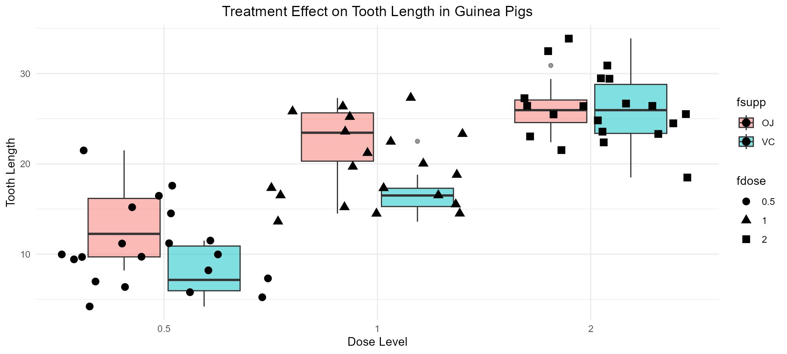
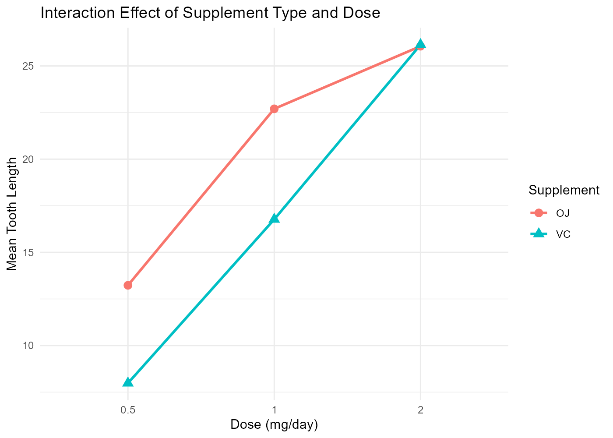
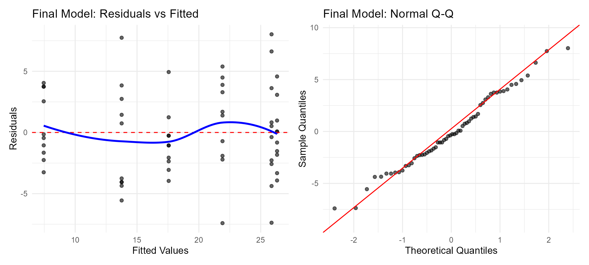
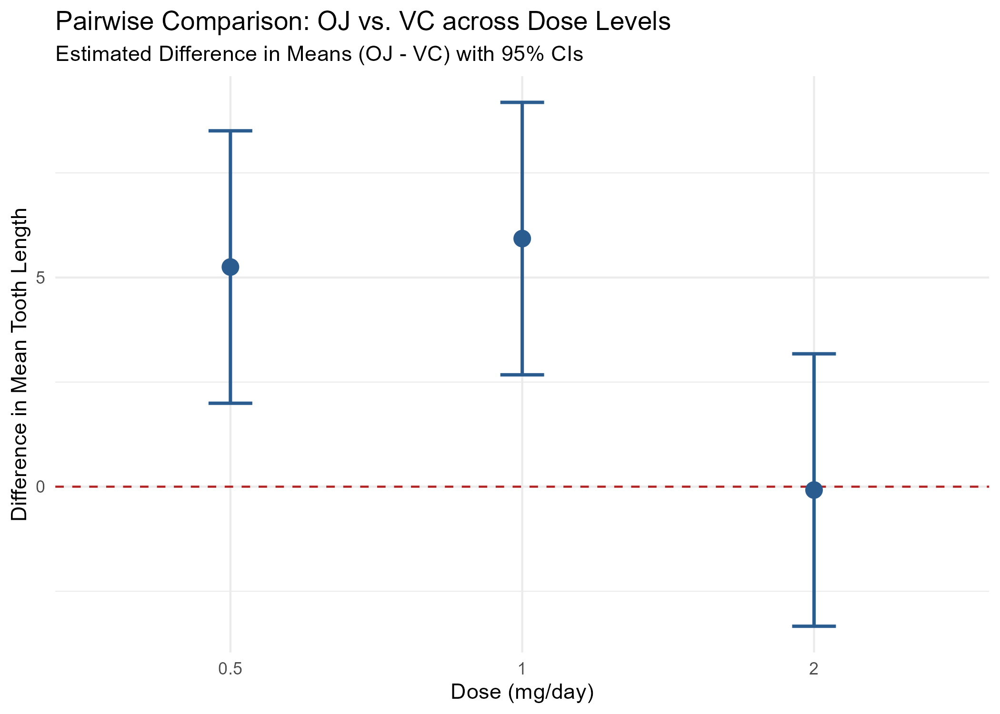

#Tooth Growth Analysis: Factorial ANOVA & Pairwise Comparisons

[](https://www.r-project.org/)
[](https://www.tidymodels.org/)
[](#)
[](LICENSE)

An exploratory data analysis and statistical modeling project evaluating the impact of **Vitamin C supplement** and **dosage level** on guinea pig tooth growth (`ToothGrowth` dataset).

🔗 **[View the Interactive Full HTML Report Here](https://katmrodriguez.github.io/index/)**

---

## Executive Summary

This study investigates whether the effect of Vitamin C on tooth length depends on the supplement type, **Orange Juice (OJ)** versus **Ascorbic Acid (VC)**, across three distinct dosage levels ($0.5$, $1.0$, and $2.0 \text{ mg/day}$). 

Key findings include:
* Both **dosage level** and **supplement** significantly impact tooth growth.
* A significant **interaction effect** exists between dose and supplement type ($p < 0.05$).
* **Orange Juice** produces significantly greater mean tooth length than Ascorbic Acid at lower doses ($0.5$ and $1.0 \text{ mg}$). However, at the highest dose ($2.0 \text{ mg}$), there is no statistically significant difference between the two supplement types.

---

## Key Visualizations

### Exploratory Data Analysis
Distribution of tooth length across dose levels and supplement types.


---

### Factorial Interaction
The interaction plot demonstrates how Orange Juice and Ascorbic Acid efficiency varies across dose levels.


---

### Model Diagnostics
Diagnostic plots confirming ANOVA assumptions (normality and homoscedasticity).


---

### Nested Pairwise Contrasts ($\text{OJ} - \text{VC}$)
Pairwise comparisons evaluated at each dose level (`fdose`). Note how the $95\%$ confidence interval at $2.0 \text{ mg/day}$ crosses zero, indicating no significant difference between OJ and VC at the highest dose.



---

## Methodology & Tech Stack

* **Language:** R
* **Core Libraries:** `tidyverse` (`ggplot2`, `dplyr`), `emmeans`, `car`
* **Statistical Methods:**
  * Exploratory Data Analysis (EDA) & Distribution Checks
  * Two-Way Factorial ANOVA ($2 \times 3$ Design)
  * Model Diagnostics (Residual Normality & Homoscedasticity)
  * Estimated Marginal Means & Simple Effect Pairwise Contrasts

---

## Repository Structure

```text
├── analysis/         
│   ├── Tooth-Growth-Factorial-ANOVA.Rmd  # Primary analysis files (.Rmd)
├── docs/             
│   └── index.html      # Compiled HTML report served via GitHub Pages
├── figures/            # High-resolution exported plot figures (.png)
│   ├── boxplot_len_dose.png
│   ├── final_diagnostics.png
│   ├── interaction_plot.png
│   └── nested_contrasts_plot.png
├── .gitignore
├── LICENSE
├── README.md # Project summary & key findings
└── Instructor-Ratings-Regression.Rproj           